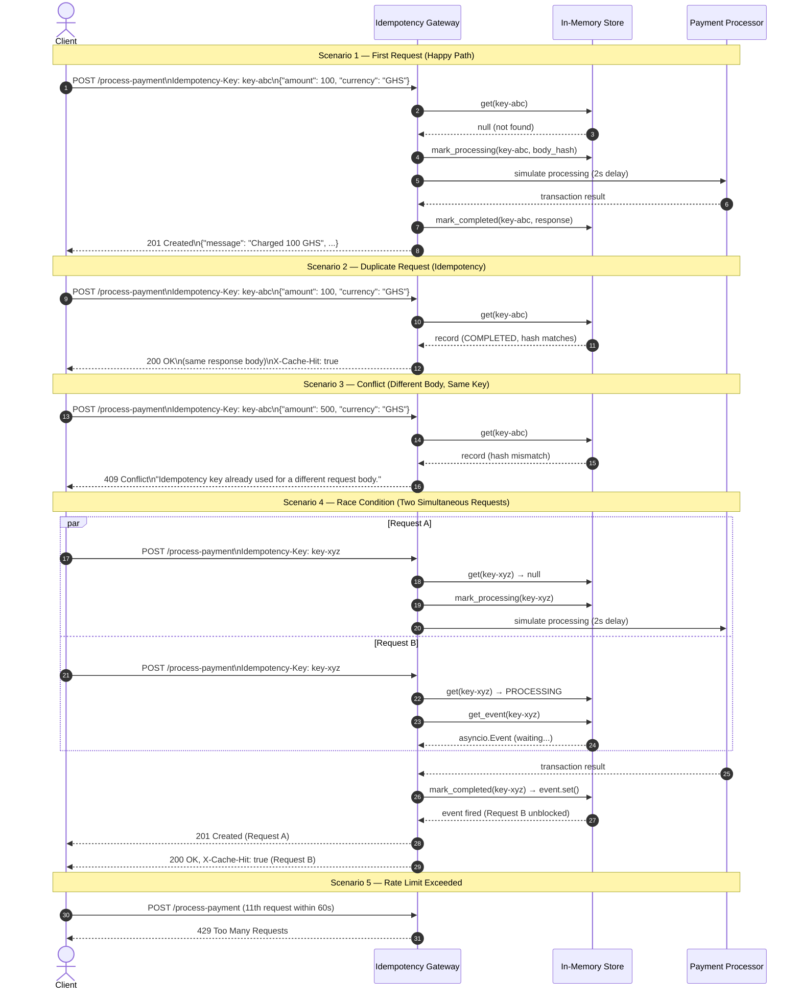

# Idempotency Gateway

A production-grade payment idempotency layer built with FastAPI. Guarantees that a payment is processed exactly once, no matter how many times the client retries the same request.

---

## Architecture Diagram

The gateway handles five distinct scenarios. The diagram below shows the full request lifecycle for each.



---

## Setup Instructions

### Prerequisites

- Python 3.11 or higher
- pip

### Installation

```bash
git clone <your-repo-url>
cd Idempotency-Gateway
python -m venv venv

# Windows
venv\Scripts\activate

# macOS / Linux
source venv/bin/activate

pip install -r requirements.txt
```

### Running the Server

```bash
uvicorn app.main:app --reload
```

The server starts on `http://127.0.0.1:8000` by default.

Interactive API docs are available at `http://127.0.0.1:8000/docs`.

### Running the Tests

```bash
pytest tests/ -v
```

---

## API Documentation

### GET /

Health check endpoint.

**Response: 200 OK**
```json
{
  "service": "Idempotency Gateway",
  "status": "healthy",
  "version": "1.0.0"
}
```

---

### POST /process-payment

Submit a payment request.

**Required Header**

| Header            | Type   | Description                                        |
|-------------------|--------|----------------------------------------------------|
| Idempotency-Key   | string | Unique client-generated key. Max 255 characters.   |

**Request Body**

| Field    | Type   | Description                                          |
|----------|--------|------------------------------------------------------|
| amount   | float  | Payment amount. Must be greater than zero.           |
| currency | string | One of: GHS, USD, EUR, GBP, NGN (case-insensitive). |

**Example Request**
```bash
curl -X POST http://127.0.0.1:8000/process-payment \
  -H "Content-Type: application/json" \
  -H "Idempotency-Key: order-9f3a1b" \
  -d '{"amount": 100, "currency": "GHS"}'
```

**Response: 201 Created (first request)**
```json
{
  "message": "Charged 100 GHS",
  "status": "success",
  "idempotency_key": "order-9f3a1b",
  "transaction_id": "d4f1a2b3-...",
  "processed_at": "2025-06-01T10:30:00+00:00"
}
```

**Response: 200 OK (duplicate request)**

Same body as above, plus header `X-Cache-Hit: true`.

**Response: 409 Conflict (same key, different body)**
```json
{
  "error": "Idempotency key already used for a different request body.",
  "hint": "Use a new Idempotency-Key if you intend to make a different payment."
}
```

**Response: 400 Bad Request (missing or invalid key)**
```json
{
  "error": "Missing Idempotency-Key header.",
  "hint": "Every request must include a non-empty Idempotency-Key header."
}
```

**Response: 422 Unprocessable Entity (invalid payload)**

Returned by FastAPI/Pydantic for validation errors (negative amount, unsupported currency, missing fields).

**Response: 429 Too Many Requests (rate limit)**
```json
{
  "error": "Too many requests.",
  "hint": "You may send at most 10 requests per 60 seconds."
}
```

**Response: 503 Service Unavailable (inflight timeout)**
```json
{
  "error": "The original request is taking too long.",
  "hint": "Please retry after a moment."
}
```

---

## Design Decisions

### Why FastAPI?

FastAPI is built on top of Starlette and runs on the ASGI protocol, which means request handlers are native Python coroutines. This was not a convenience choice — it was required to correctly implement the race condition scenario. The `asyncio.Event` mechanism only works inside a single event loop. FastAPI gives us that single loop across all concurrent requests, so one coroutine can set an event and another can await it without any shared threading state.

### Race Condition: asyncio.Event over polling

When a request is received, the gateway immediately writes the key to the store with a `PROCESSING` status and creates an `asyncio.Event`. If a second identical request arrives while the first is still running, it finds the `PROCESSING` record, retrieves the same `Event` object, and calls `await event.wait()`. The first request calls `event.set()` when it completes, which unblocks the second instantly. This avoids polling entirely and adds zero latency overhead to the second caller.

### Body Hashing

Payload comparison uses SHA-256 of the JSON-serialised body with keys sorted (`sort_keys=True`). This ensures that `{"amount": 100, "currency": "GHS"}` and `{"currency": "GHS", "amount": 100}` are treated as the same payload, which is the correct semantic behaviour for idempotency.

### In-Memory Store

The store is a plain Python dict. This is intentional for this implementation — it is simple, dependency-free, and has no network overhead. The limitation is that it does not survive a server restart, and it cannot be shared across multiple server processes. In production, the store would be replaced with Redis, which supports atomic operations, distributed locking, and native TTL expiry.

### TTL Expiry

Keys expire after 24 hours. Expiry is checked eagerly on every `get()` call, so no expired record is ever returned. A background coroutine also sweeps the store once per hour to reclaim memory from expired entries.

---

## Developer's Choice: Structured Audit Logging + IP-Based Rate Limiting

Two additional features were implemented beyond the core acceptance criteria.

### Structured Audit Logging

Every significant event produces a structured log entry. Entries are written simultaneously to stdout (for live monitoring) and appended to `audit_log.json` in JSONL format (one JSON object per line).

Logged events: `PAYMENT_PROCESSED`, `DUPLICATE_DETECTED`, `CONFLICT_DETECTED`, `INFLIGHT_WAIT`, `INFLIGHT_TIMEOUT`, `KEY_EXPIRED`, `RATE_LIMITED`.

Each entry includes the timestamp, event type, idempotency key, client IP, and a details object with event-specific fields (amount, currency, transaction ID, hash values).

This matters in a real Fintech system because regulators and fraud investigators need a tamper-evident chronological record of every transaction decision. A structured JSONL file can be streamed directly into any log aggregation tool (Datadog, Splunk, ELK) without a parsing step.

### IP-Based Rate Limiting

The gateway enforces a limit of 10 requests per 60-second sliding window per client IP. This is implemented with a pure in-memory `deque` per IP — no external dependency required. The window is sliding, not fixed: timestamps older than 60 seconds are evicted before each check, so the limit is always accurate to the current moment.

This prevents a single misbehaving client from flooding the idempotency store with fabricated keys, which could exhaust memory or obscure legitimate audit trails.

---

## Project Structure

```
Idempotency-Gateway/
├── app/
│   ├── __init__.py
│   ├── main.py          - FastAPI app, lifespan, CORS
│   ├── routes.py        - Endpoint handlers
│   ├── storage.py       - Idempotency store with TTL and asyncio.Event
│   ├── models.py        - Pydantic request and response models
│   ├── logger.py        - Structured audit logging
│   └── rate_limiter.py  - Sliding-window IP rate limiter
├── tests/
│   ├── __init__.py
│   └── test_payment.py  - Full test suite (happy path, duplicates, conflicts, race conditions)
├── docs/
│   └── sequence_diagram.md
├── requirements.txt
├── pytest.ini
└── .gitignore
```

---

## Known Limitations

- The in-memory store is lost on server restart. Use Redis with atomic operations for production deployments.
- Rate limiting state is also in-memory and not shared across multiple server instances.
- The idempotency store is not protected by an explicit lock. It is safe under asyncio's cooperative multitasking model, but would require a lock (or Redis transactions) under true multi-threaded concurrency.
