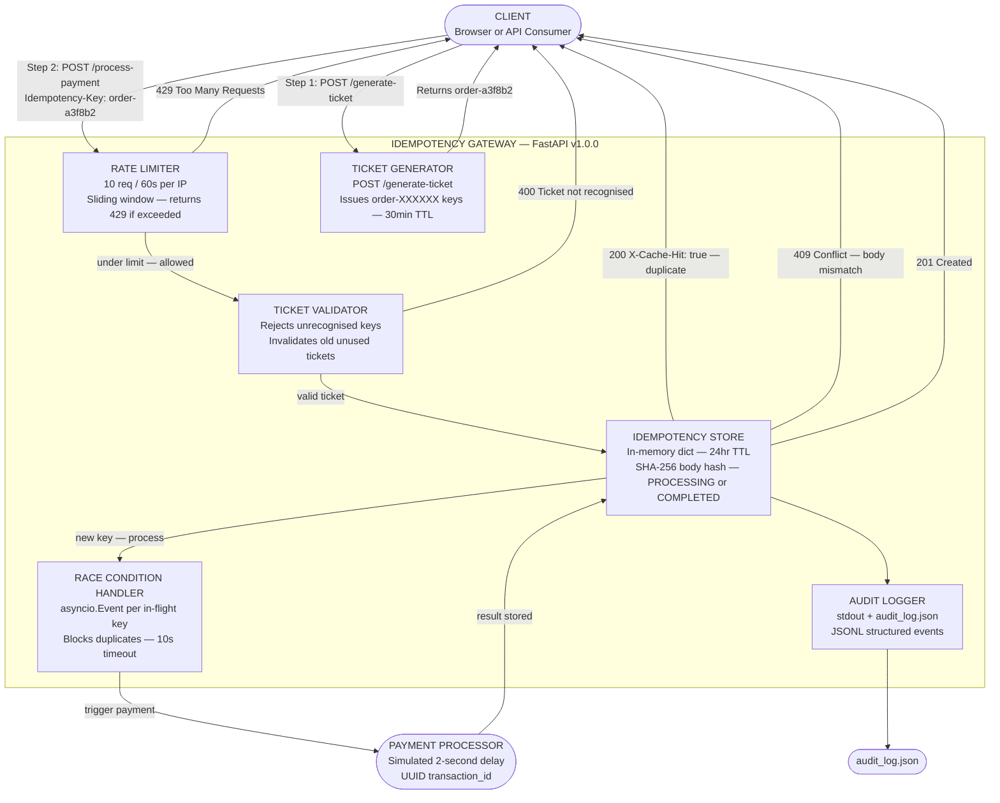

# Architecture Diagram

The diagram below shows all components of the Idempotency Gateway and how they communicate.

---

## Component Overview

| Component | Role |
|---|---|
| Client | Browser or API consumer that initiates payment requests |
| Rate Limiter | Sliding-window guard — 10 requests per 60 seconds per IP |
| Ticket Generator | Issues unique `order-XXXXXX` keys via `POST /generate-ticket` |
| Ticket Validator | Rejects any key not issued by the ticket system |
| Idempotency Store | In-memory dict storing records with SHA-256 body hash, status, and 24-hour TTL |
| Race Condition Handler | One `asyncio.Event` per in-flight key — blocks duplicate requests without polling |
| Audit Logger | Writes structured JSONL events to stdout and `audit_log.json` |
| Payment Processor | Simulated 2-second delay producing a UUID `transaction_id` |

---

