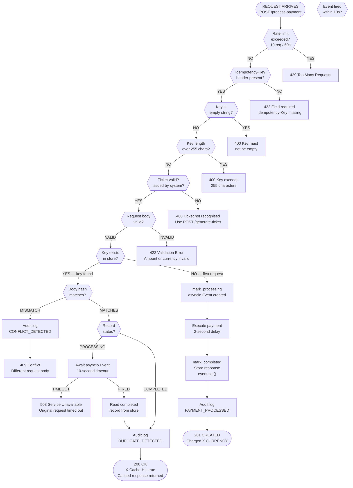

# Decision Flowchart

The flowchart below shows every decision the gateway makes when a `POST /process-payment` request arrives.

---

## Decision Logic Summary

Every incoming request passes through these checks in order. The first failure exits immediately — no further checks run.

| Step | Check | Pass | Fail |
|---|---|---|---|
| 1 | Rate limit per IP (10 req / 60s) | Continue | 429 |
| 2 | `Idempotency-Key` header present | Continue | 422 |
| 3 | Key is not empty string | Continue | 400 |
| 4 | Key length within 255 characters | Continue | 400 |
| 5 | Key was issued by `POST /generate-ticket` | Continue | 400 |
| 6 | Request body is valid (amount, currency) | Continue | 422 |
| 7 | Key not in idempotency store | Process payment → 201 | Check body hash |
| 8 | Body hash matches stored hash | Return cached response → 200 | 409 |
| 9 | Stored status is COMPLETED | Return instantly | Await `asyncio.Event` |
| 10 | Event fires within 10 seconds | Return cached response → 200 | 503 |

---

