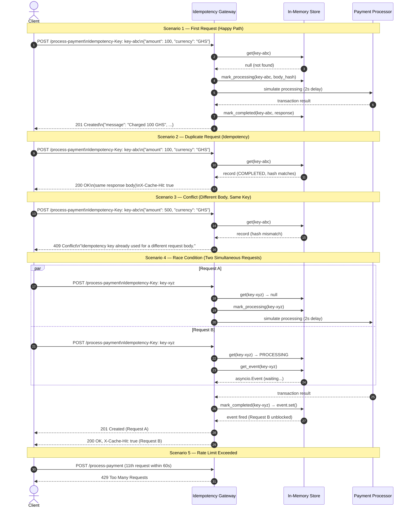

# Sequence Diagram

The diagram below covers all five scenarios handled by the Idempotency Gateway.

```mermaid
sequenceDiagram
    autonumber
    actor Client
    participant Gateway as Idempotency Gateway
    participant Store as In-Memory Store
    participant Payment as Payment Processor

    note over Client,Payment: Scenario 1 — First Request (Happy Path)
    Client->>Gateway: POST /process-payment\nIdempotency-Key: key-abc\n{"amount": 100, "currency": "GHS"}
    Gateway->>Store: get(key-abc)
    Store-->>Gateway: null (not found)
    Gateway->>Store: mark_processing(key-abc, body_hash)
    Gateway->>Payment: simulate processing (2s delay)
    Payment-->>Gateway: transaction result
    Gateway->>Store: mark_completed(key-abc, response)
    Gateway-->>Client: 201 Created\n{"message": "Charged 100 GHS", ...}

    note over Client,Payment: Scenario 2 — Duplicate Request (Idempotency)
    Client->>Gateway: POST /process-payment\nIdempotency-Key: key-abc\n{"amount": 100, "currency": "GHS"}
    Gateway->>Store: get(key-abc)
    Store-->>Gateway: record (COMPLETED, hash matches)
    Gateway-->>Client: 200 OK\n(same response body)\nX-Cache-Hit: true

    note over Client,Payment: Scenario 3 — Conflict (Different Body, Same Key)
    Client->>Gateway: POST /process-payment\nIdempotency-Key: key-abc\n{"amount": 500, "currency": "GHS"}
    Gateway->>Store: get(key-abc)
    Store-->>Gateway: record (hash mismatch)
    Gateway-->>Client: 409 Conflict\n"Idempotency key already used for a different request body."

    note over Client,Payment: Scenario 4 — Race Condition (Two Simultaneous Requests)
    par Request A
        Client->>Gateway: POST /process-payment\nIdempotency-Key: key-xyz
        Gateway->>Store: get(key-xyz) → null
        Gateway->>Store: mark_processing(key-xyz)
        Gateway->>Payment: simulate processing (2s delay)
    and Request B
        Client->>Gateway: POST /process-payment\nIdempotency-Key: key-xyz
        Gateway->>Store: get(key-xyz) → PROCESSING
        Gateway->>Store: get_event(key-xyz)
        Store-->>Gateway: asyncio.Event (waiting...)
    end
    Payment-->>Gateway: transaction result
    Gateway->>Store: mark_completed(key-xyz) → event.set()
    Store-->>Gateway: event fired (Request B unblocked)
    Gateway-->>Client: 201 Created (Request A)
    Gateway-->>Client: 200 OK, X-Cache-Hit: true (Request B)

    note over Client,Payment: Scenario 5 — Rate Limit Exceeded
    Client->>Gateway: POST /process-payment (11th request within 60s)
    Gateway-->>Client: 429 Too Many Requests
```
