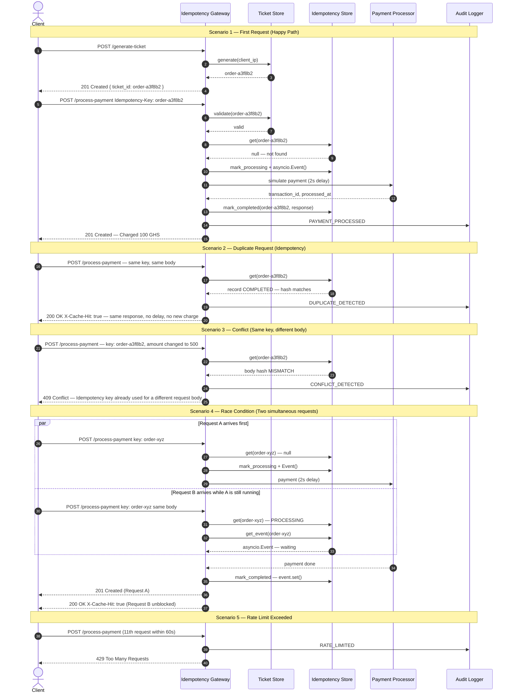

# Sequence Diagram

The diagram below covers all five scenarios handled by the Idempotency Gateway.

---

```mermaid
sequenceDiagram
    autonumber
    actor Client
    participant GW as Idempotency Gateway
    participant TS as Ticket Store
    participant IS as Idempotency Store
    participant PP as Payment Processor
    participant AL as Audit Logger

    note over Client,AL: Scenario 1 — First Request (Happy Path)
    Client->>GW: POST /generate-ticket
    GW->>TS: generate(client_ip)
    TS-->>GW: order-a3f8b2
    GW-->>Client: 201 Created { ticket_id: order-a3f8b2 }
    Client->>GW: POST /process-payment Idempotency-Key: order-a3f8b2
    GW->>TS: validate(order-a3f8b2)
    TS-->>GW: valid
    GW->>IS: get(order-a3f8b2)
    IS-->>GW: null — not found
    GW->>IS: mark_processing + asyncio.Event()
    GW->>PP: simulate payment (2s delay)
    PP-->>GW: transaction_id, processed_at
    GW->>IS: mark_completed(order-a3f8b2, response)
    GW->>AL: PAYMENT_PROCESSED
    GW-->>Client: 201 Created — Charged 100 GHS

    note over Client,AL: Scenario 2 — Duplicate Request (Idempotency)
    Client->>GW: POST /process-payment — same key, same body
    GW->>IS: get(order-a3f8b2)
    IS-->>GW: record COMPLETED — hash matches
    GW->>AL: DUPLICATE_DETECTED
    GW-->>Client: 200 OK X-Cache-Hit: true — same response, no delay, no new charge

    note over Client,AL: Scenario 3 — Conflict (Same key, different body)
    Client->>GW: POST /process-payment — key: order-a3f8b2, amount changed to 500
    GW->>IS: get(order-a3f8b2)
    IS-->>GW: body hash MISMATCH
    GW->>AL: CONFLICT_DETECTED
    GW-->>Client: 409 Conflict — Idempotency key already used for a different request body

    note over Client,AL: Scenario 4 — Race Condition (Two simultaneous requests)
    par Request A arrives first
        Client->>GW: POST /process-payment key: order-xyz
        GW->>IS: get(order-xyz) — null
        GW->>IS: mark_processing + Event()
        GW->>PP: payment (2s delay)
    and Request B arrives while A is still running
        Client->>GW: POST /process-payment key: order-xyz same body
        GW->>IS: get(order-xyz) — PROCESSING
        GW->>IS: get_event(order-xyz)
        IS-->>GW: asyncio.Event — waiting
    end
    PP-->>GW: payment done
    GW->>IS: mark_completed — event.set()
    GW-->>Client: 201 Created (Request A)
    GW-->>Client: 200 OK X-Cache-Hit: true (Request B unblocked)

    note over Client,AL: Scenario 5 — Rate Limit Exceeded
    Client->>GW: POST /process-payment (11th request within 60s)
    GW->>AL: RATE_LIMITED
    GW-->>Client: 429 Too Many Requests
```
